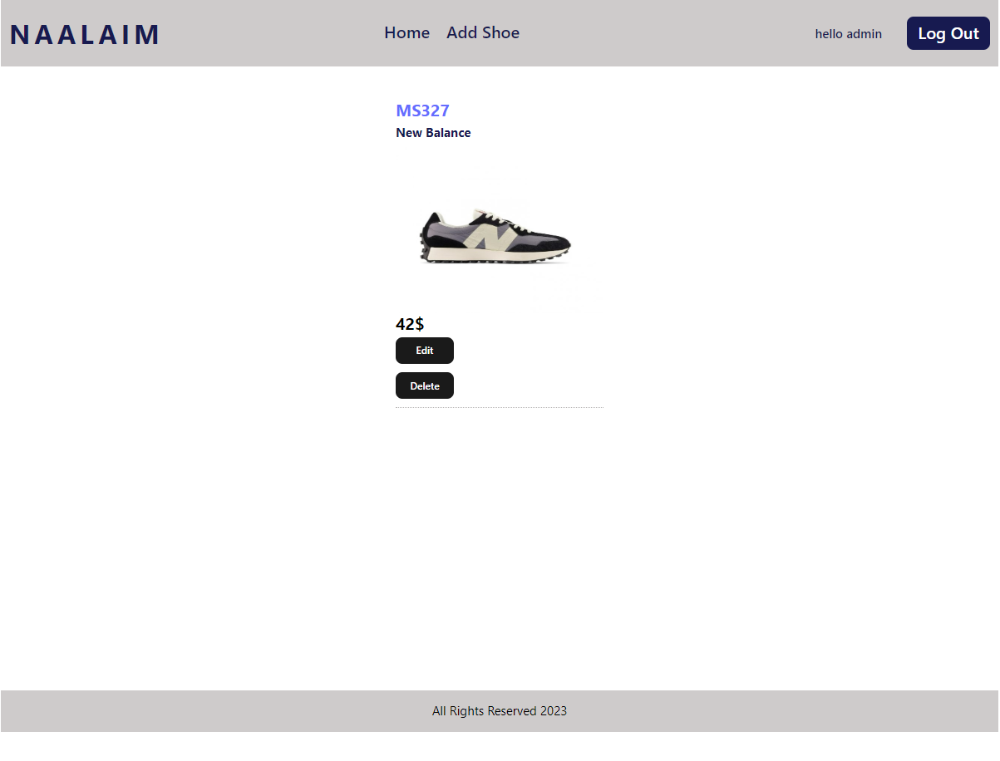

# Shoe CRUD App

## Table of Contents

- [Shoe CRUD App](#shoe-crud-app)
  - [Table of Contents](#table-of-contents)
  - [Acknowledgments](#acknowledgments)
  - [Overview](#overview)
  - [Live Demo](#live-demo)
  - [Features](#features)
  - [Tech Stack](#tech-stack)
  - [Screenshots](#screenshots)
    - [Home Screen](#home-screen)
    - [Login Screen](#login-screen)
    - [Shoe Screen](#shoe-screen)
    - [Edit Shoe Screen](#edit-shoe-screen)
    - [Error Toast](#error-toast)
  - [Getting Started](#getting-started)
  - [API Integration](#api-integration)
    - [Environment Variable Protection](#environment-variable-protection)
    - [Request Management](#request-management)
  - [Context Management](#context-management)
    - [Authentication Context](#authentication-context)
    - [Shoe Context](#shoe-context)
  - [Custom Hooks](#custom-hooks)
    - [`useShoeForm`](#useshoeform)
    - [`useLoginForm`](#useloginform)
    - [`useShoe`](#useshoe)
  - [User Experience](#user-experience)
    - [Input Components](#input-components)
    - [Shoe Card Components](#shoe-card-components)
  - [Code Reusability](#code-reusability)
  - [Error Management](#error-management)
  - [License](#license)


## Acknowledgments

This project is based on the [React Shoe Shop](https://github.com/MariaPinchasi/react-shoe-shop) repository created by Maria Pinchasi. Many of the architectural decisions, UI elements, and functionalities were inspired by her work. Special thanks to Maria for providing a robust foundation upon which this application could be built. Please add a star to her work!

## Overview

This is a Shoe CRUD application that allows users to Create, Read, Update, and Delete shoe entries. The app is integrated with a mock API for demonstration purposes.

## Live Demo

Visit the [live demo](https://obrm-shoe-app-demo.netlify.app).

## Features

- CRUD Operations
- Mock User Authentication
- Global State Management
- Custom Hooks
- Error Notifications


## Tech Stack

- React.js
- React Router
- Axios
- mockApi
- react-toastify

## Screenshots

---
### Home Screen


---
### Login Screen


---

### Shoe Screen


---

### Edit Shoe Screen


---

### Error Toast 


---
## Getting Started

1. Clone the repository from `https://github.com/obrm/shoes-app-demo`.
2. Install dependencies with `npm install`.
3. Add the `.env` file based on the `.env.sample` file included in the repository.
4. Run the application using `npm run dev`.


## API Integration

All the API calls are available in the `api.js` file in the `api` folder.
### Environment Variable Protection

- The API URL is secured in an `.env` file, which is omitted from the repository for security reasons. Refer to `.env.sample` for the expected variables.

### Request Management

- A generic request function is available for making API calls. This function is utilized in other utility functions designed for specific request types (GET, POST, PUT, DELETE).

```javascript
const request = async (method, endpoint, data = null) => {
    const res = await axios({
        method,
        url: `${BASE_URL}${endpoint}`,
        data,
    });
    return res.data;
};

export const getAllShoes = async () => {
    return await request('get', '/');
};

// and so on...
```


## Context Management

### Authentication Context

- Manages user authentication and stores user details in local storage for persistence.

### Shoe Context

- This global state is responsible for getting all the shoes and is updated when a shoe is added, edited, or deleted. Ensures immediate reflection of changes across all components.


## Custom Hooks

### `useShoeForm`

- Encapsulates the logic for the shoe form. Common logic for adding and editing a shoe is centralized here.

### `useLoginForm`

- Manages the logic for the login form.

### `useShoe`

- Additional custom hook is employed for separating logic and view in the `Shoe` component.


## User Experience

### Input Components

- JSX repetition for input elements is avoided by creating reusable Input components. 

### Shoe Card Components

- A `ShoeCard` component is used to iterate over the array of shoes and display them on the Home screen.


## Code Reusability

- A single `ManageShoe` component is used for both adding and editing shoes, depending on the presence of `shoeId` in the URL, avoiding the need to use two separate components.


## Error Management

- User-friendly error notifications are shown using the [`react-toastify`](https://www.npmjs.com/package/react-toastify) package. It's centralized in the App component to handle errors application-wide.


## License

- This project is licensed under the MIT License.


